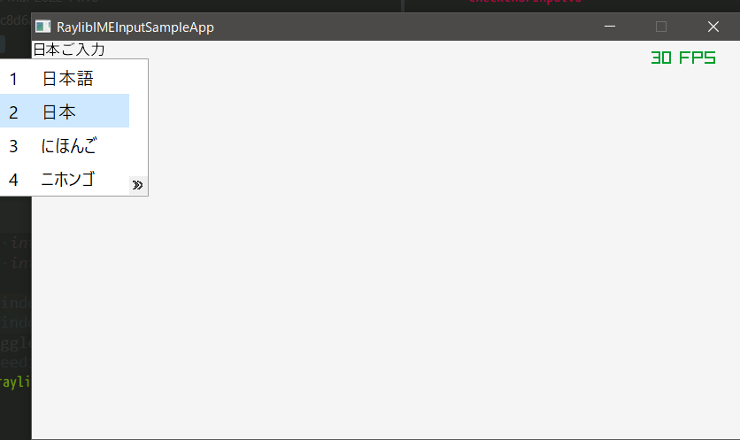

# Raylib IME Input Sample App

This is a sample application for Japanese input with [raylib](https://github.com/raysan5/raylib).



# How to build and run

## Windows

There are 2 ways to build this app.

- With raylib built by **internal** GLFW
- With raylib built by **external** GLFW
  - Mainly use this way for the development

### Prepare

Install the following tools.

- cmake: https://cmake.org/download/
- mingw32-make: https://sourceforge.net/projects/mingw-w64/files/
- freetype binaries: https://github.com/ubawurinna/freetype-windows-binaries
    - `$ git clone https://github.com/ubawurinna/freetype-windows-binaries.git`

### With raylib built by internal GLFW

1. Build the forked raylib in which we are developing IME support: https://github.com/clear-code/raylib/tree/better-ime-support

```sh
$ git clone --branch=better-ime-support https://github.com/clear-code/raylib.git
$ cd raylib
$ cmake -B build -G "MinGW Makefiles" -D CMAKE_INSTALL_PREFIX=bin -D BUILD_EXAMPLES=OFF
$ mingw32-make -C build install
```

2. Build and run this app
    - Specify the path of raylib built in step-1 to `RAYLIB`
        - Ex: `-D RAYLIB="C:/test/raylib/bin"`
    - Specify the path of freetype to `FREETYPE`
        - Ex: `-D FREETYPE="C:\\test\\freetype-windows-binaries"` (We can use both `/` and `\\` for the separetor)

```sh
$ cmake -B build -G "MinGW Makefiles" -D CMAKE_INSTALL_PREFIX=bin -D RAYLIB="{...}" -D FREETYPE="{...}"
$ mingw32-make -C build install
$ cd bin
$ .\RaylibIMEInputSampleApp.exe
```

### With raylib built by external GLFW

1. Clone and add some fixes to the forked GLFW in which we are developing IME support: https://github.com/clear-code/glfw/tree/3.4-2021-06-09+im-support

Clone the repository.

```sh
$ git clone --branch=3.4-2021-06-09+im-support https://github.com/clear-code/glfw.git
$ cd glfw
```

Add the following fix to `glfw3native.h` to avoid duplicated declaration errors.

```diff
--- a/include/GLFW/glfw3native.h
+++ b/include/GLFW/glfw3native.h
@@ -90,7 +90,10 @@ extern "C" {
   #undef APIENTRY
   #undef GLFW_APIENTRY_DEFINED
  #endif
- #include <windows.h>
+ // #include <windows.h>
+ typedef void *PVOID;
+ typedef PVOID HANDLE;
+ typedef HANDLE HWND;
```

2. Build the GLFW

```sh
$ cmake -B build -G "MinGW Makefiles" -D CMAKE_INSTALL_PREFIX=bin
$ mingw32-make -C build install
```

3. Build the forked raylib in which we are developing IME support: https://github.com/clear-code/raylib/tree/better-ime-support
    - Set `USE_EXTERNAL_GLFW` `ON`
    - Specify the path of GLFW built in step-2 to `CMAKE_PREFIX_PATH`
        - Ex: `-D CMAKE_PREFIX_PATH=C:/test/glfw/bin`

```sh
$ git clone --branch=better-ime-support https://github.com/clear-code/raylib.git
$ cd raylib
$ cmake -B build -G "MinGW Makefiles" -D CMAKE_INSTALL_PREFIX=bin -D BUILD_EXAMPLES=OFF -D USE_EXTERNAL_GLFW=ON -D CMAKE_PREFIX_PATH="{...}"
$ mingw32-make -C build install
```

4. Build and run this app
    - Specify the path of raylib built in step-3 to `RAYLIB`
        - Ex: `-D RAYLIB="C:/test/raylib/bin"`
    - Specify the path of freetype to `FREETYPE`
        - Ex: `-D FREETYPE="C:\\test\\freetype-windows-binaries"`
    - Set `USE_EXTERNAL_GLFW` `ON`
    - Specify the path of GLFW built in step-2 to `GLFW`
        - Ex: `-D GLFW="C:/test/glfw/bin"`

```sh
$ cmake -B build -G "MinGW Makefiles" -D CMAKE_INSTALL_PREFIX=bin -D RAYLIB="{...}" -D FREETYPE="{...}" -D USE_EXTERNAL_GLFW=ON -D GLFW="{...}"
$ mingw32-make -C build install
$ cd bin
$ .\RaylibIMEInputSampleApp.exe
```

## Ubuntu

There are 2 ways to build this app.

- With raylib built by **internal** GLFW
- With raylib built by **external** GLFW
  - Mainly use this way for the development

### With raylib built by internal GLFW

1. Build the forked raylib in which we are developing IME support: https://github.com/clear-code/raylib/tree/better-ime-support
    - Refer to: https://github.com/raysan5/raylib/wiki/Working-on-GNU-Linux

```sh
$ sudo apt install libasound2-dev mesa-common-dev libx11-dev libxrandr-dev libxi-dev xorg-dev libgl1-mesa-dev libglu1-mesa-dev
$ git clone --branch=better-ime-support git@github.com:clear-code/raylib.git
$ cd raylib
$ cmake -B build -DCMAKE_INSTALL_PREFIX=bin
$ make -C build -j$(nproc) install
```

2. Build and run this app
    - Specify the path of raylib built in step-1 to `CMAKE_PREFIX_PATH`
        - Ex: `-DCMAKE_PREFIX_PATH=/test/raylib/bin`

```sh
$ cmake -B build -DCMAKE_INSTALL_PREFIX=bin -DCMAKE_PREFIX_PATH={...}
$ make -C build -j$(nproc) install
$ cd bin
$ ./RaylibIMEInputSampleApp
```

### With raylib built by external GLFW

1. Build the forked GLFW in which we are developing IME support: https://github.com/clear-code/glfw/tree/3.4-2021-06-09+im-support

```sh
$ git clone --branch=3.4-2021-06-09+im-support git@github.com:clear-code/glfw.git
$ cd glfw
$ cmake -B build -DCMAKE_INSTALL_PREFIX=bin
$ make -C build -j$(nproc) install
```

2. Build the forked raylib in which we are developing IME support: https://github.com/clear-code/raylib/tree/better-ime-support
    - Refer to: https://github.com/raysan5/raylib/wiki/Working-on-GNU-Linux
    - Set `USE_EXTERNAL_GLFW` `ON`
    - Specify the path of GLFW built in step-1 to `CMAKE_PREFIX_PATH`
        - Ex: `-DCMAKE_PREFIX_PATH=/test/glfw/bin`

```sh
$ sudo apt install libasound2-dev mesa-common-dev libx11-dev libxrandr-dev libxi-dev xorg-dev libgl1-mesa-dev libglu1-mesa-dev
$ git clone --branch=better-ime-support git@github.com:clear-code/raylib.git
$ cd raylib
$ cmake -B build -DCMAKE_INSTALL_PREFIX=bin \
  -DUSE_EXTERNAL_GLFW=ON \
  -DCMAKE_PREFIX_PATH={path of GLFW build in step-1}
$ make -C build -j$(nproc) install
```

3. Build and run this app
    - Set `USE_EXTERNAL_GLFW` `ON`
    - Specify both of the path of GLFW built in step-1 and raylib built in step-2 to `CMAKE_PREFIX_PATH`
        - Ex: `-DCMAKE_PREFIX_PATH="/test/glfw/bin;/test/raylib/bin;"`

```sh
$ cmake -B build -DCMAKE_INSTALL_PREFIX=bin \
  -DUSE_EXTERNAL_GLFW=ON \
  -DCMAKE_PREFIX_PATH="{path of GLFW build in step-1};{path of raylib build in step-2};"
$ make -C build -j$(nproc) install
$ cd bin
$ ./RaylibIMEInputSampleApp
```

### Common notes

If `freetype` is not found, you may need `libfreetype6-dev` or `libfreetype-dev`.

```sh
$ sudo apt install libfreetype6-dev
```

## MacOS

1. Install cmake and freetype.

```console
$ brew install cmake
$ brew install freetype
```

2. Build the forked raylib in which we are developing IME support: https://github.com/clear-code/raylib.git

```console
$ git clone --branch=better-ime-support https://github.com/clear-code/raylib.git
$ cd raylib
$ cmake -B build -DCMAKE_INSTALL_PREFIX=bin -DBUILD_EXAMPLES=OFF
$ make -C build install
```

3. Build and run this app
    - Currently impossible to build with the `better-ime-support` branch of raylib.

```console
$ cmake -B build -DCMAKE_INSTALL_PREFIX=bin -DCMAKE_PREFIX_PATH={...}/raylib/bin
$ make -C build install
$ cd bin
$ ./RaylibIMEInputSampleApp
```

# Licenses

## This Program

Copyright (C) 2022 鏡原 尚 <kagamihara@sena-networks.co.jp>  
Copyright (C) 2022 Daijiro Fukuda <fukuda@clear-code.com>  

This program is free software: you can redistribute it and/or modify
it under the terms of the GNU General Public License as published by
the Free Software Foundation, either version 3 of the License, or
(at your option) any later version.

This program is distributed in the hope that it will be useful,
but WITHOUT ANY WARRANTY; without even the implied warranty of
MERCHANTABILITY or FITNESS FOR A PARTICULAR PURPOSE.  See the
GNU General Public License for more details.

You should have received a copy of the GNU General Public License
along with this program.  If not, see <https://www.gnu.org/licenses/>.

## 源真ゴシック GenShinGothic-Regular.ttf

本ソフトでは表示フォントに「源真ゴシック」(http://jikasei.me/font/genshin/) を使用しています。  
Licensed under SIL Open Font License 1.1 (http://scripts.sil.org/OFL)  
© 2015 自家製フォント工房, © 2014, 2015 Adobe Systems Incorporated, © 2015 M+  
FONTS PROJECT
