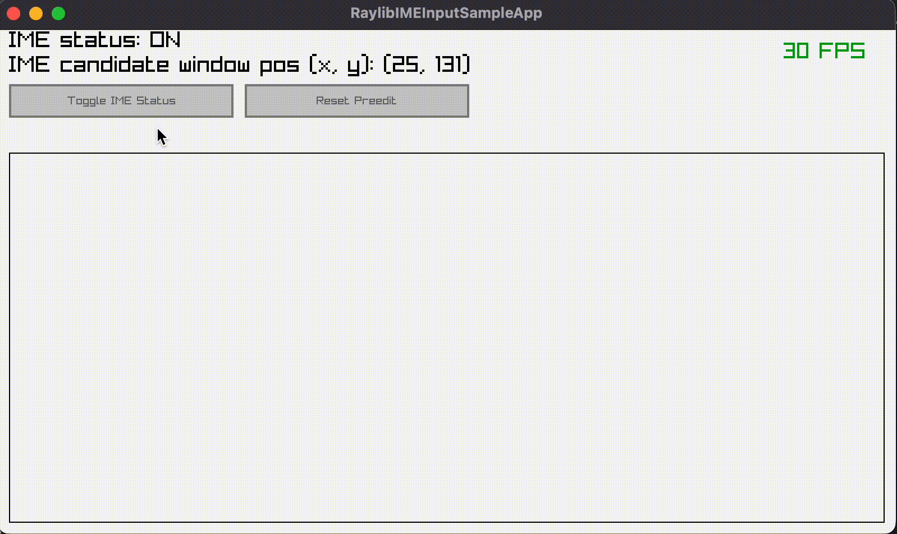

# Raylib IME Input Sample App

This is a sample application for Japanese input with [raylib](https://github.com/raysan5/raylib).

# How to build and run

Intended to run on the following multiple platforms:

* Windows
* macOS
* GNU/Linux(X11, Wayland)

Please see [wiki](https://github.com/clear-code/RaylibIMEInputSampleApp/wiki) for details.

# Licenses

## This Program

Copyright (C) 2022 鏡原 尚 <kagamihara@sena-networks.co.jp>
Copyright (C) 2022 Daijiro Fukuda <fukuda@clear-code.com>
Copyright (C) 2022 Takuro Ashie <ashie@clear-code.com>

This program is free software: you can redistribute it and/or modify
it under the terms of the GNU General Public License as published by
the Free Software Foundation, either version 3 of the License, or
(at your option) any later version.

This program is distributed in the hope that it will be useful,
but WITHOUT ANY WARRANTY; without even the implied warranty of
MERCHANTABILITY or FITNESS FOR A PARTICULAR PURPOSE.  See the
GNU General Public License for more details.

You should have received a copy of the GNU General Public License
along with this program.  If not, see <https://www.gnu.org/licenses/>.

## 源真ゴシック GenShinGothic-Regular.ttf

本ソフトでは表示フォントに「源真ゴシック」(http://jikasei.me/font/genshin/) を使用しています。  
Licensed under SIL Open Font License 1.1 (http://scripts.sil.org/OFL)  
© 2015 自家製フォント工房, © 2014, 2015 Adobe Systems Incorporated, © 2015 M+  
FONTS PROJECT
